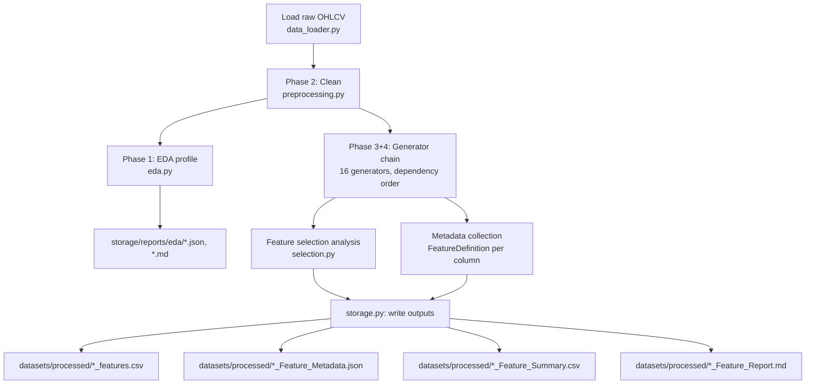

# Sprint 2 — Feature Engineering — Workflow & Class Diagram

## Sprint-Level Workflow

```
Sprint 2
  |
  v
Data Preprocessing (Phase 2)
  |
  v
Feature Engineering (Phase 3: price / trend / momentum / volatility /
                      bollinger / macd / volume / rolling / lag / date / target)
  |
  v
Technical Analysis Engine (Phase 4: price action / support & resistance /
                            supply & demand / fibonacci / market structure / breakout)
  |
  v
Processed Dataset
```

## Run-Level Workflow (what happens inside `FeatureEngineeringPipeline.run()`)



## Class Diagram

```mermaid
classDiagram
    class FeatureEngineeringPipeline {
        +FeatureEngineeringConfig config
        +list~BaseFeatureGenerator~ generators
        +run(ticker, raw_path, raw_df, version) FeatureEngineeringResult
    }

    class BaseFeatureGenerator {
        <<abstract>>
        +str group_name
        +tuple requires_columns
        +generate(df) DataFrame
        +_compute(df) DataFrame*
        +describe() list~FeatureDefinition~*
    }

    class PriceFeatureGenerator
    class TrendFeatureGenerator
    class MomentumFeatureGenerator
    class VolatilityFeatureGenerator
    class BollingerFeatureGenerator
    class MACDFeatureGenerator
    class VolumeFeatureGenerator
    class RollingFeatureGenerator
    class LagFeatureGenerator
    class DateFeatureGenerator
    class PriceActionFeatureGenerator
    class SupportResistanceFeatureGenerator
    class FibonacciFeatureGenerator
    class MarketStructureFeatureGenerator
    class BreakoutFeatureGenerator
    class TargetFeatureGenerator

    BaseFeatureGenerator <|-- PriceFeatureGenerator
    BaseFeatureGenerator <|-- TrendFeatureGenerator
    BaseFeatureGenerator <|-- MomentumFeatureGenerator
    BaseFeatureGenerator <|-- VolatilityFeatureGenerator
    BaseFeatureGenerator <|-- BollingerFeatureGenerator
    BaseFeatureGenerator <|-- MACDFeatureGenerator
    BaseFeatureGenerator <|-- VolumeFeatureGenerator
    BaseFeatureGenerator <|-- RollingFeatureGenerator
    BaseFeatureGenerator <|-- LagFeatureGenerator
    BaseFeatureGenerator <|-- DateFeatureGenerator
    BaseFeatureGenerator <|-- PriceActionFeatureGenerator
    BaseFeatureGenerator <|-- SupportResistanceFeatureGenerator
    BaseFeatureGenerator <|-- FibonacciFeatureGenerator
    BaseFeatureGenerator <|-- MarketStructureFeatureGenerator
    BaseFeatureGenerator <|-- BreakoutFeatureGenerator
    BaseFeatureGenerator <|-- TargetFeatureGenerator

    class FeatureDefinition {
        +str name
        +str group
        +str formula
        +str meaning
        +str interpretation
        +str priority
        +tuple recommended_for
        +as_dict() dict
    }

    class FeatureEngineeringConfig {
        <<frozen dataclass>>
        +tuple sma_windows
        +tuple ema_windows
        +int rsi_period
        +int atr_period
        +... other tunables
        +tuple enabled_feature_groups
    }

    class FeatureEngineeringResult {
        +str ticker
        +str version
        +DataFrame dataframe
        +list~FeatureDefinition~ feature_definitions
        +FeatureSelectionReport selection_report
        +Path processed_csv_path
        +Path metadata_json_path
        +Path feature_report_md_path
    }

    FeatureEngineeringPipeline --> BaseFeatureGenerator : builds via Factory
    FeatureEngineeringPipeline --> FeatureEngineeringConfig : uses
    FeatureEngineeringPipeline --> FeatureEngineeringResult : returns
    BaseFeatureGenerator --> FeatureDefinition : describes
    BaseFeatureGenerator --> FeatureEngineeringConfig : reads tunables from
```

