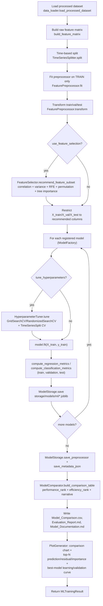
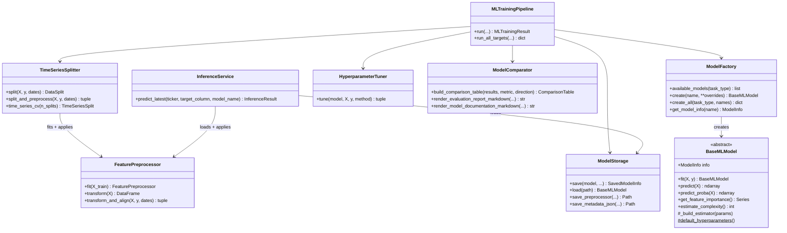

# Sprint 3 — Machine Learning Pipeline — Workflow & Class Diagram

## Sprint-Level Workflow

```
Sprint 3
  |
  v
Data Loading (build_feature_matrix)
  |
  v
Time-Based Split + Leakage-Free Preprocessing
  |
  v
[Optional] Feature Selection
  |
  v
Per-Model: [Optional Tuning] -> Fit -> Evaluate -> Persist   (x 15 models)
  |
  v
Comparison + Reporting + Visualization
```

## Run-Level Workflow (what happens inside `MLTrainingPipeline.run()`)



## Class Diagram

